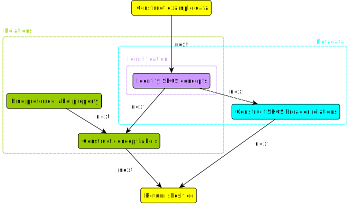

# Skosify OWL ontology example

This example demonstrates debugging capabilities of SPipes engine. Let's assume that SPipes web application 
is running at `http://localhost:8080/s-pipes`. Script [skosify.sms.ttl](skosify.sms.ttl) contains *pipeline* 
that can be called with:

    http://localhost:8080/s-pipes/service?id=skosify

The *pipeline* constructs sample OWL ontology about organisms and returns a SKOS view on that ontology. 
The script can be visualized as follows:

.

It has 3 ontology submodules (submodules are imported transitively by `owl:imports` statement in [skosify.sms.ttl](skosify.sms.ttl)): 
- [Identification](identification.ttl) - identifies SKOS concepts within OWL ontology.
- [Relations](relations.ttl) - constructs SKOS relations between provided SKOS concepts.
- [Metadata](metadata.ttl) - constructs SKOS metadata for provided SKOS concepts.

## Pipeline example data

"Construct example data" module constructs triples about organisms:
```
:organism a owl:Class ;
    rdfs:label "Organism" ;
.
:person a owl:Class ;
    rdfs:label "Person" ;
    rdfs:subClassOf :organism ;
.
:animal a owl:Class ;
    rdfs:label "Animal" ;
    rdfs:subClassOf :organism ;
.
:cat a owl:Class ;
    rdfs:label "Cat" ;
    rdfs:subClassOf :animal ;
.
:dog a owl:Class ;
    rdfs:label "Dog" ;
    rdfs:subClassOf :animal ;
.
:lassie-movie-star a owl:NamedIndividual ;
    rdfs:label "Lassie" ;
    a :dog ;
.
:laika-space-animal a owl:NamedIndividual ;
    rdfs:label "Laika" ;
    a :dog ;
.
```

## Pipeline output

The pipeline transforms provided data into [data represented by SKOS vocabulary](skosify-output.jsonld).


# Debugging 

There is possibility to execute any module within the script separately using SPipes REST endpoint `/module`.
As an example, consider following http POST request using `curl` call:
```
curl --location --request POST 'http://localhost:8080/s-pipes/module?id=http://onto.fel.cvut.cz/ontologies/s-pipes/skosify-example-0.1/metadata/construct-labels&_pConfigURL=file:///SPIPES_DIR/s-pipes/doc/examples/skosify/module-execution/config.ttl&_pInputBindingURL=file:///SPIPES_DIR/doc/examples/skosify/module-execution/construct-labels--input-binding.ttl' \
--header 'Content-Type: text/turtle' \
--data "@/SPIPES_DIR/doc/examples/skosify/module-execution/construct-labels--input-model.ttl"
```

Note that `SPIPES_DIR` need to be replaced with proper path to the root of this project.
Parameter `_pConfigURL` points to a configuration file that contains 
configuration of the logging (this is not required) and configuration of the module.

- The configuration of the logging is:
```
[
    a    spipes:progress-listener ;
    spipes:has-classname "cz.cvut.spipes.logging.AdvancedLoggingProgressListener" ;
    alpl:p-metadata-repository-name "s-pipes-skosify" ;
    alpl:p-rdf4j-server-url "http://localhost:8080/rdf4j-server" ;
    alpl:p-execution-group-id "s-pipes-skosify-testing" ;
] .
```

- The configuration of the module is:
```
sk-meta:construct-labels
  a sml:ApplyConstruct ;
  sml:constructQuery [
      a sp:Construct ;
      sp:text """CONSTRUCT {
   ?concept skos:prefLabel ?label .
} WHERE {
   ?concept a skos:Concept . 
   ?concept ?prefLabelProperty ?label .
}
""" ;
    ] ;
  sml:replace true ;
  rdfs:label "Construct concept labels" ;
.
```

Note that if we would not need specific logging we could directly set parameter `_pConfigURL` to 
`file:///SPIPES_DIR/s-pipes/doc/examples/skosify/metadata.ttl`, where the configuration is specified.

Moreover, instead of using parameter `_pInputBindingURL` to load input variable bindings from a file we could use
query parameters of the request, i.e. `prefLabelProperty=http://www.w3.org/2000/01/rdf-schema#label`.

Lastly, input model is provided in the body of the request. 
The http request produces [output in json-ld format](module-execution/construct-labels--output-model.jsonld).
